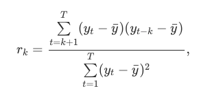

```{r setup, include=FALSE}
knitr::opts_chunk$set(echo = TRUE, eval=TRUE, message=FALSE,warning=FALSE,fig.width=10,fig.height =10)
```

# Introduction

In this article, we will reviewing and exploring the **timetk** and **tidyvert** family R packages, where will be conducting an overall comparison analysis to look at how the different collection work for time series forecasting using the targeted dataset. The article would be spitted into two article where the the first article would be about the different in data manipulation and feature selection method for *timetk* against *tidyvert*. Whereas in the second article would be on the reviewing of the forecasting methodology between *timetk* and *tidyvert*

For part 1 of the series of the article, in the first section of the article, we would looking into the current techniques used by *tidyvert* collection on how the data structure is being set up to perform data cleaning and wrangling after the extraction of dataset via web scrapping. After which, we will be reviewing the ability to perform feature engineering to look at how time series features, decompositions, statistical summaries and convenient visualizations could be perform by *tidyvert* collection. 

In the next section of the article, we would be looking at the same concept but with the use of the *timetk* collection instead. Lastly, we will be reviewing both collection to analysis its similarities vs difference as well the strengthen and cases to use individual collection.

# Setting up environment

We would first start with setting up the environment and installation of the packages required for data transformation using R. To ensure that we had cleared the environment to perform data manipulation, we would remove prior R object using the code below

```{r}
rm(list=ls())
```

Next, we would run the following code chunk to validate if the required packages are installed. In the event that the packages are not installed, the code will install the missing packages. Afterwhich, the code would read the required package library onto the current environment.

```{r}
packages = c('tidyverse','tidyquant','tsibbledata','tsibble','feasts','timetk',
             'ggplot2','stats','lubridate','data.table','rmarkdown','knitr')
for (p in packages) {
  if(!require(p,character.only = T)){
    install.packages(p)
  }
  library(p,character.only = T)
}
```

# Import dataset

In this article, we will be using the dataset from the *nycflights13* packages that contain a collection of data that is related to the different airline flying from different airport in New York City (NYC). 

The dataset is inclusive of 5 set of data points, namely airlines, airports, flights, planes and weather. Over here in this article, we will be using the weather dataset, where it contain weather related variable like temperature, humid and precipitation.

```{r}
weather = read_csv("data/weather.csv")

paged_table(weather)
```

# Tidyvert Collection

The *tidyvert* collection is adapted from the popular *forecast* R package that is widely used in the past for time series forecasting using various classic time series model. The R *forecast* R packages provides different methods and tools for display and analysing of time series forecasts including exponential smoothing via state space models and automatic ARIMA modelling. 

*tidyvert* collection is the new suite of packages for tidy time series analysis, that integrates easily into the tidyverse way of working. Much of the work on the set of packages under the *tidyvert* collection has been done by Rob Hyndman, professor of statistics at Monash University, and his team. The intention of the development of the *tidyvert* collection is for the replacement of the very popular *forecast* package. As of today, the *forecast* R package had retired in favour of *fable* package that is under the *tidyvert* collection as well.

**Type of packages under the *tidyvert* collection for data manipulation and feature extraction:**

**1. tsibble - work along with dplyr for data manipulation **

**2. fable - tool used for feature extraction, decomposition of time series analysis and statistical analysis for the time series analysis**

In the next few section of the article, we will be reviewing and discussing how the set of packages within the *tidyvert* collection work and collaborate to perform time series analysis as well as data manipulation.

## tsibble

The *tsibble* package provides an infrastructure for the tidy of temporal data (represents a state in time) using wrangling tools within the *tsibble* package. Also *tsibble* package is mainly used to transform the dataframe into tibble dataframe structure. Adapting the tidy data principles, tsibble dataframe format is required for the *tidyvert* collection.

*tsibble* consists of several properties that allow the:

* Indexing of variable with inherent ordering from past to present.
* Where key is a set of variables that define observational units over time.
* Each observation should be uniquely identified by index and key.
* Each observational unit should be measured at a common interval, if regularly spaced.

The following code will demonstrate how the *as_tsibble()* function from the *tsibble* package to transform dataframe into tibble dataframe format. Also, to coerce a dataframe into tsibble dataframe, user will need to declare key and index. The code is demonstrated using the **weather dataset** that is from the *nycflights13* package as mentioned earlier.

```{r}
weather_tsbl = as_tsibble(weather, key = origin, index = time_hour)

paged_table(weather_tsbl)
```

Additionally,*tsibble* is able to turn implicit missing values into explicit missing values, where we could use *fill_gaps()* to turn implicit to explicit form. The methodology of using *fill_gaps()* is shown in the code below where the *fill_gaps()* function is similar to how we had use *fill()* within *tidyr* to replace NAs based on its previous observation using time series analysis.

```{r}
full_weather = weather_tsbl %>%
  fill_gaps() %>% 
  group_by_key() %>% 
  tidyr::fill(temp, humid, .direction = "down")

paged_table(full_weather)
```

Another feature of *tsibble* package would be the ability to aggregate over calendar periods demostrated in the code chunk where this could be performed using *index_by()* and *summarise()*. *index_by()* is has similar function as *group_by* where it is used to group index only while *summarise()* is the function that aggregates selected variables over time periods.

Also, *index_by()* could be use as index functions for *as.Date()*, *yearweek()*, *yearmonth()* and *yearquarter()* to allow us to compute quarterly/monthly/weekly aggregations.

```{r}
full_weather_mth_agg=full_weather %>%
  group_by_key() %>%
  index_by(year_month = ~ yearmonth(.)) %>% 
  summarise(
    avg_temp = mean(temp, na.rm = TRUE),
    sum_precip = sum(precip, na.rm = TRUE)
  )

paged_table(full_weather_mth_agg)
```

Using function such as *summarise()*, *group_by()* and *index_by()* from the *tsibble* package will help to take into account of the update of key and index respectively. Using a combination of *index_by() + summarise()* as shown in the above code can help with regularizing a tsibble of irregular time space too.

## feasts

*feasts* package that is within the *tidyvert* collection is mainly used for the feature extraction and statistics for time series analysis. Also, *feasts* package provides a set of tools within the package that it is useful for the analysis of time series data. 

Working with tidy temporal data that was previously set up using *tsibble* package, it is able to compute time series features, decomposition, statistical summaries and graphical visualizations. Features extraction is useful in the understanding of the behavior of time series data together with the closely integration of the tidy forecasting workflow used in the *fable* package.

### Time series pattern (time plot)

To begin our analysis, we will first start with plotting a time plot using the *auto_plot()* function to look at the time plot of our dataset. *auto_plot()* automatically create an appropriate plot of choosen variable against time. In this case, it recognizes humidity level as a time series and produces a time plot as shown below. 

From the figure below, we are able to observe that the humidity level fluctuate of high volatility that cause the understanding of the time plot to be rather challenging. In the next few section of the the article we will be looking into the different analysis of the time plot to try to identify if we are able to observed any trend/seasonal/cyclic pattern.

```{r}
full_weather %>%
  autoplot(humid)+
  labs(title = "Humidity level of hourly meterological data",
       subtitle = "mainly from LGA, JFK and EWR airport dataset",
       y = "Humidity level")
```

### Seasonal plot and seasonal subseries plot

With the *feasts* package, user is able to plot time plot based on the given time period in the dataset. We are also able to use the *gg_season()* and *gg_subseries()* to plot the season plot and there change in the seasonality respectively. Without the use of *group_by()* function, we are able to review the time plot of individual airport using *gg_season()* and *gg_subseries()* function. The code below would shown how we are able to use *gg_season()* to plot the different season plot based on individual airport. Similar technique is used for *gg_subseries* as well.

```{r}
full_weather %>%
   gg_season(humid)+
  labs(title = "Humidity level of hourly meterological data",
       subtitle = "Individual time plot for for LGA, JFK and EWR airport dataset",
       y = "Humidity level")
```
Figure above is the same time plot as shown using *autoplot()* where the data point of each season are overlapped. A seasonal plot allows the underlying seasonal pattern to be seen more clearly, this is especially useful in for dataset within varying years or locations etc where it allow user to analyze the dataset further to look into the pattern changes over the year or based on location.

Time period of the time plot using the *autoplot()* and *gg_season()* function could be further look into yearly, monthly or weekly using the *period* tool within both function as shown in the following code.

```{r}
full_weather %>%
   gg_season(humid, period = "week")+
  labs(title = "Humidity level of hourly meterological data",
       subtitle = "Individual time plot for for LGA, JFK and EWR airport dataset",
       y = "Humidity level")
```
From the figure above, we are able to observed that overall there is a similar seasonal trend for the EWR, JFK and LGA airport where the overall humidity fluctuate of the same cycle within the same week. This *period* tool allow user to perform time anlysis much effectively.

### Lag plots

Lag plot would be an one of the approach to look a correlation of lagged observation (vertical axis) against the current observation, with points colored hourly in a scatterplot format.The correlations of the lag plots shown with the code below using the *gg_lag()* are what that make up the ACF. Where the stronger the correlation the closer the scatterplot point will be to the dotted line.

```{r}
full_weather_2013 = full_weather %>%
  filter(origin == "JFK") %>%
  mutate(quarter= case_when(
      month >= 1 & month <= 3 ~ 'Q1'
      , month >= 4 & month <= 6 ~ 'Q2'
      , month >= 7 & month <= 9 ~ 'Q3'
      , month >= 10 & month <= 12 ~ 'Q4')) %>%
    select(origin, month, temp, humid, precip) 

full_weather_2013 %>%
   gg_lag(humid, geom = "point")+
   labs(title = "Lag plot of the time plot of the humidity level of hourly meterological data",
       y = "Humidity level")
```

### Autocorrelation Plot (ACF/PACF/CCF)

Correlation analysis is another form of measure that we could identify within the *fable* package. Correlation measures the extent of a relationship between two variables while autocorrelation measures the linear relationship between lagged values of a time series.

There are several autocorrelation coefficients corresponding to each panel in the lag plot. Where r1 measure the relationship between yt and yt-1 and r2 measure the relationship between yt and yt-2 and so on.



where T is length of the time series and that the autocorrelation coefficient make up the autocorrelation function (ACF). *ACF()* within the *feast* package allow us to compute ACF value as compare to its individual lag time as shown below using the weather dataset of JFK airport only. Similar technique is used for Partial autocorrelation function-*PACF()* and Cross Correlation Functions-*CCF()* as well.

```{r}
full_weather_acf=full_weather_2013 %>% ACF(humid, lag_max = 36)
paged_table(full_weather_acf)
```
The values in the acf column are r1,...,r9 where it is corresponding to the nine scatterplots in that we had plotted earlier on under lag plat section. Ploting of the ACF allow us to see how the correlations change with the lag k, where the plot is also known as correlogram.

```{r}
full_weather_2013 %>%
  ACF(humid) %>%
  autoplot() + labs(title="ACF plot of the humidity level of hourly meterological data of JFK")
```
As shown in the ACF plot above, the humidity dataset of JFK airport do hava a trend which is similar to our analysis earlier on. This assumption is further validated where the autocorrelations for small lags tend to be large and positive as observations near in time are also near in ACF value. As such, the ACF of a trended time series tends to have positive values that slowly decrease as the lags increase which is similar to the ACF plot shown above.

When data are seasonal, the autocorrelations will be larger for the seasonal lags (at multiples of the seasonal period) than for other lags.

When data are both trended and seasonal, you see a combination of these effects. The data plotted in figure above shows both trend and seasonality using the ACF plot. The slow decrease in the ACF as the lags increase is due to the trend, while the “scalloped” shape is due to the seasonality.

### Composite plot

*gg_tsdisplay()* function within the *feasts* package allow the user to plot a time series along with its ACF along with an customizable third graphic of either a PACF, histogram, lagged scatterplot or spectral density under the *plot_type* option of the *gg_tsdisplay()*. 

The following code below would demostrated how it is used and over here in our composite plot, we had selected the *plot_type='auto'* to allow us to have view on the composite plot default setting. Similar technique is used for *gg_tsresiduals()* as well where user is able to ensemble plots for time series residuals.

```{r}
full_weather_2013 %>%
   gg_tsdisplay(humid)+
   labs(title = "Summarize time series analysis of the humidity level of hourly meterological data of JFK airport",
       y = "Humidity level")
```

### Decomposition

Another major concept of time series analysis would be looking at decomposition. Time series decomposition is the isolation of the structural components such as trend and seasonality from the main data to allow user to better analysis trend/seasonal/cycle pattern. 

When decomposing a time series into components,the three components that we could decompose would be trend-cycle, seasonal and remainder component (containing anything else in the time series). Within our time series, there can be more than one seasonal component, corresponding to the different seasonal periods as such decomposition is important for the time series analysis.

Within *feasts* package we would be using *classical_decomposition()* and *STL()* functions which came from the *decompose()* and *stl()* from the *stats* package. Decomposition function in the *feasts* package look into the extraction of seasonal/trend/cycle components from a time series persepctive. 

When decomposing a time series, it is useful to adjust the series or data transformation in order to make the decomposition less complex as possible. Some method of adjustment include:

1. Calendar adjustment

2. Population adjustment

3. Inflation adjustment

4. Box-Cox Transformation - the use of power and logarithms transformation that is useful to solve the issue of the dataset having variation that increase/decrease with the level of the series.

The *STL()* functions in *feasts* package use a model-like formula interface, allowing you to control many aspects of the decomposition (using season(window = 5) allows the seasonality to change fairy quickly for quarterly data). The following code below will show how the *STL()* is used and that in this article we will be using the population adjustment to filter the dataset to just JFK airport weather only for our time series decomposition.


```{r}
full_weather_stl=full_weather %>% 
  group_by(origin) %>% 
  filter(origin == "JFK") %>%
  summarise(humid = sum(humid)) %>% 
  model(STL(humid ~ season(window = 5))) %>% 
  components()

paged_table(full_weather_stl)
```

Next, we will be using the *autoplot()*, *gg_season()* to plot out the time series graphic to show how each decomposed components vary within each time plot. Also, it allow us to visualise the seasonality without distractions of trend and remainder terms. The code chunk show how we are able to use *autoplot()* to plot the decomposition of the weather dataset from JFK airport into four component (trend, season_week, season_day and remainder). Similar technique is used for *gg_season* as well.

```{r}
full_weather_stl %>% 
  group_by(origin) %>% 
  filter(origin == "JFK") %>%
  summarise(humid = sum(humid)) %>% 
  model(STL(humid ~ season(window = 5))) %>% 
  components() %>%
  autoplot()+
  labs(title = "Time series decomposition of the humidity level of hourly meterological data of JFK airport",
       y = "Humidity level")
```
The four component (trend, season_week, season_day and remainder) of the time series decomposition are shown separately in the bottom four panels. These components can be added together to form the time plot shown in the top panel. We are able to observe that seasonal component changes over time where the weekly humidity level had a seasonal pattern that as compared to the daily time period. The remainder component at the bottom panel would be the remainder after the seasonal and trend-cycle components have been removed from the dataset.

Grey bars at the left of individual panel show the relative scales of the components. Each represents the same length but as the plots are on different scales, the bars vary in size. The largest grey bar in the trend panel explain to us that the variation in the trend component is the smallest compared to rest of the component. If we were to rescale the other three component dataset, then all of the compoent would be of the same scale.

### Time series features

Within the *feasts* package, we are also able to conduct statistical analysis such as the calculation of mean, maximum etc. Autocorrelations as discussed earlier on are some of the key feature of time series. In this part of the code, we will looking at how numerical summary is calculated using the *feature* function. Over here, we will be computing the average humidity level of individual airport dataset.

```{r}
full_weather_mean=full_weather %>%
  features(humid, list(mean = mean)) %>%
  arrange(mean)

paged_table(full_weather_mean)
```

Overall, the *tidyvert* collection had been very useful in the data manipulation, feature extraction as well as the time series series. By having the dataset being easily convertible from the standard dataframe to tsibble dataframe format had allow the remaining analysis to be conducted easily with a fix structure data format.

The time series graphic within the *feasts* pacakge, allow user to be able to manipulate the dataset easily according to their needs following the *dplyr* package format structure. Also using the various time series we are able to see individual and combination of the season, trend and cycle component that allow us to perform time series analysis.


## timetk

The *timetk* collection is a tidyverse toolkit to visualize, wrangle and transform time series data with much more interactive graphical visual. As mention in the post earlier here, we are able to understand and review the different function and tool that is within the *timetk* collection mianly for data visulization.

In this article I will looking into how data manipulation, time series decomposition and feature extraction could be done using *timetk* collection and how it is different from the *tidyvert* collection.

The same weather dataset from the *nycflights13* package would be used and re-ingested to ensure that the comparison of the *tidyvert* and *timetk* collection is consistent. 

### Data Wrangling

To begin our analysis, similarly as before we will start with data wrangling. We also be injecting the dataset to ensure that the dataset used had not been manipulated using the (\tidyvert* collection. The *timetk* collection includes several essential data wrangling tools. In this article, we will be looking at the following functions:

1. Summarise by Time - Time-based aggregations 

2. Filter by Time - Time-based filtering

3. Pad by Time - Filling in gaps 

#### Summarize by Time

With *summarise_by_time()* we are able to aggregate the dataset with the required period using *SUM()* as well as period smoothing with either *AVERAGE(), FIRST(),LAST()* function. With the *SUM()* function we are able to compute the total humidity level of each week, as shown in the next line of code.

```{r}
weather = weather %>% 
  select(origin, year, month, day, time_hour, temp, humid, precip)

weather %>%
  group_by(origin) %>%
  summarise_by_time(
    time_hour, .by = "week",
    humid = SUM(humid)
  ) %>%
  plot_time_series(time_hour, humid, .facet_ncol = 2, .interactive = FALSE, .y_intercept = 0)
```
Period smoothing can also be computed where using *AVERAGE()* where we will be able to get the dataset average value that help in the smoothing of the weather dataset as shown. Similar technique could be done using *FIRST()* or *MEDIAN()*.

```{r}
weather %>%
  group_by(origin) %>%
  summarise_by_time(
    time_hour, .by = "month",
    adjusted = AVERAGE(humid)
  ) %>%
  plot_time_series(time_hour, adjusted, .facet_ncol = 2, .interactive = FALSE, .y_intercept = 0)
```

#### Filter by Time

In next part of data wrangling, we will looking at time filter to allow user to be able to select the dataset with their required time period using the *filter_by_time()* function. For the weather dataset, we would like to understand how the humidity level had change in the lower half of year 2013, by allocating the start_date to beginning of June and end_date to be the end of December we would be able to filter the required time period.

```{r}
weather %>%
  group_by(origin) %>%
  filter_by_time(time_hour, "2013-06-01","2013-12-31") %>%
  plot_time_series(time_hour, humid, .facet_ncol = 2, .interactive = FALSE, .y_intercept = 0)
```
#### Padding Data

Padding data would implies that we are able to fill in missing datapoint of the dataset which *tidyvert* collection had a similar concept as well. Using the *padr* package within the *timetk* collection, we are able to fill in missing datapoint easily.

Dataset that had been collected at times might not always be completed hence through *pad_by_time()* user will be able to fill in missing data to allow the irregular time series be regular. This is process is done through using *pad_value* where it would auto filling in the missing value/gaps of the weather dataset based on current dataset.

```{r}
full_weather = weather %>%
  pad_by_time(time_hour, .by = "auto") 

paged_table(full_weather)
```

### Time series graphical visuliation

#### Single Plot

After data wrangling of the dataset, we will be looking into the various graphical feature on the ploting of time plot of the weather dataset. Where within the *timetk* collection, the *plot_time_series()* function is used to generates an interactive plotly chart by default.

Also, we are able to use the following two function to allow the time series plot to be much more interactive where setting *.interactive = TRUE* and *.plotly_slider = TRUE* allow the user to hover datapoint and use the date slider at the bottom of the chart.C

ompared to plot using *tidyvert* collection in *feasts* package, the figure plotted using *timetk* allow the user to better understand the dataset and filter the dataset according to their time series analysis needs.

```{r}
full_weather %>%
  plot_time_series(.date_var=  time_hour, .value = humid, 
                   .line_size = 0.2, .line_color = "#3879A3",
                   .title = "Humidity level of hourly meterological data",
                   .x_lab = "Time period",
                   .y_lab = "Humidity Level",
                   .interactive=TRUE, .plotly_slider = TRUE)
```

#### Group Plot

The next line of code would demonstrate how we are able grouped data base on their different origin of the weather dataset with *group_by()* before we plot using *plot_time_series()*. As the dataset consist of humidity level of different origin the time plot above could be rather confusing and does not allow user to be able to understand with its huge volatility. Having a group plot of the individual time plot of each airport, would enable user to have a better judgement.

Other than grouping we are also able to filter dataset to the time period of Q1 only using a combination of *mutate()* and *filter()*. Moreover, we are also able to apply different color to each of the week number using *color_var* within the *plot_time_series()* function. With the *color_var* the date column is transformed into lubridate::month() number.

```{r}
full_weather %>%
  group_by(origin) %>%
  mutate(quarter= case_when(
      month >= 1 & month <= 3 ~ 'Q1'
      , month >= 4 & month <= 6 ~ 'Q2'
      , month >= 7 & month <= 9 ~ 'Q3'
      , month >= 10 & month <= 12 ~ 'Q4')) %>%
  filter(quarter == "Q1") %>%
  
  plot_time_series(.date_var=  time_hour, .value = humid, 
                   .color_var = month(time_hour),      
                   #.facet_ncol = 2, .facet_scales = "free_x",
                   .title = "Humidity level of hourly meterological data bases on individual origin",
                   .interactive=TRUE)
```

From the above figure, we are able to notice that with the use of *color_var* we better able to identify a common trend of humidity level within the same time period of the three airport location. This further shows the important of color visualization to allow the analysis to be more effective.

Also the *timetk* collection allow the time series visualization to be converted from interactive *plotly* to static format of *ggplot2* just by changing the interactive option from *TRUE* to *FALSE* as shown in the code below. From this user, is easily able to translate their result onto their report or presentation while having the ability to choose to have it interactive if required.

```{r}
full_weather %>%
  group_by(origin) %>%
  mutate(quarter= case_when(
      month >= 1 & month <= 3 ~ 'Q1'
      , month >= 4 & month <= 6 ~ 'Q2'
      , month >= 7 & month <= 9 ~ 'Q3'
      , month >= 10 & month <= 12 ~ 'Q4')) %>%
  filter(quarter == "Q1" & origin == "JFK") %>%
  
  plot_time_series(.date_var=  time_hour, .value = humid, 
                   .color_var = month (time_hour), 
                   .interactive=FALSE,
                   .facet_ncol = 2, .facet_scales = "free",
                   .title = "Humidity level of hourly meterological data bases on individual origin",
                   .x_lab = "Time period",
                   .y_lab = "Humidity Level",
                   .color_lab = "Month") + scale_y_continuous(labels = scales::comma_format())
```

### Correlation Plot in time series

As mentioned before, correlation analysis is done in time series where we will be using autocorrelation to measure the linear relationship between lagged values of a time series. As some of the past lags have predictive information that would be useful in our forecast of the predicted time series. 

Measuring level of correlation between a series and its lags using the *timetk* package is performed using *plot_acf_diagnostics()*, where we are able to compute ACF and PACF with the desired lag time that user input.

* ACF plot - Autocorrelation between a target variable and lagged versions of itself

* PACF plot - Partial Autocorrelation removes the dependence of lags on other lags highlighting key seasonalities.

```{r}
weather %>%
    group_by(origin) %>%
    plot_acf_diagnostics(
        time_hour, humid,               # ACF & PACF
        .lags = "9 days",          # 9-Days of hourly lags
        .interactive = TRUE
    )
```
The formula for the critical value is +1.96/sqrt(n) and -1.96/sqrt(n) where n is the length of the time series. This is to ensure the significance of the ACF plots and that for a white noise time series, 95% of the acf points should fall within this range. 

As the figure plotted above is not the usual ACF plot, it is rather difficult to translate the ACF result to under at which lag k would the time series cut. We will be reploting the ACF value with the used of the *full_weather_acf* dataset that we had compuated using the *tidyverse* collection. After we had calculated the ACF value of each lag k and its critical value, we will then use *ggplot2* package to plot out the common ACF plot for interpretation.

```{r}
full_weather_acf_plot = full_weather_acf %>%
  mutate(Upper_critical=1.96/sqrt(8730)) %>%
  mutate(Lower_critical=-1.96/sqrt(8730))

paged_table(full_weather_acf_plot)
```
Similar result as the *tidyvert* package is observed where the ACF plot shows that the dataset is not stationary and that it contain a seasonal pattern. The following code chunk, would display the how the ACF plot would be manually plot with the use of having line and bar plot in one figure.

```{r}
ggplot()+
  geom_bar(data=full_weather_acf_plot, aes(x = lag ,y = acf), 
           stat='identity',width = 0.01, color = "black") +
  geom_line(data=full_weather_acf_plot, aes(x = lag ,y = Upper_critical), 
           stat='identity',width = 0.05, color = "blue",linetype = 2) +
  geom_line(data=full_weather_acf_plot, aes(x = lag ,y = Lower_critical), 
           stat='identity',width = 0.05, color = "blue",linetype = 2) +
  labs(title = 'ACF plot of humidity level at JFK '
       ,y = 'ACF value'
       ,x = 'Lag') +
  theme(text = element_text(color = "#444444", family = 'Helvetica Neue')
        ,plot.title = element_text(size = 26, color = '#333333')
        ,plot.subtitle = element_text(size = 13)
        ,axis.title = element_text(size = 14, color = '#333333')
        ,axis.title.y = element_text(angle = 0, vjust = .5)
        )
```

### Seasonality plot in time series

Beside the single and group time series visualization, *timetk* collection allow user to perform visualize the time series by seasonality (in hours, days, weeks or months).By using the *plot_seasonal_diagnostics()* function as shown in the code below, we are able to identify any seasonal trend or hidden pattern of the whole weather dataset or individual airport weather dataset as shown in the plot below respectively.

```{r}
weather %>%
    plot_seasonal_diagnostics(time_hour, humid, .interactive = FALSE)
```

```{r}
weather %>%
  group_by(origin) %>%
    plot_seasonal_diagnostics(time_hour, humid, .interactive = FALSE)
```
### Anomaly detection

Another important function of *timetk* would be the easiness to perform anomaly detection. Anomaly detection is where we identify data point that has unusual high/low value within the dataset. In other words, that data point is different from the rest.

In *timetk*, we are able to identify anomaly detection visualization using *plot_anomaly_diagnostics()* function and to split the dataset by year. The code below allow us to be to identify the anomaly detection for the humidity level of the weather dataset in year 2013. Hence, we can see from the figure below that the dataset do not contain anomalies datapoint as it did not flag out any red dots.

```{r}
weather %>%
  group_by(origin) %>%
  filter(origin == "JFK") %>%
  plot_anomaly_diagnostics(time_hour, humid, .interactive=TRUE)
```
Overall, with *timetk* we are able to perform time series analysis with a greater control in data visulization. This is especially so with the different interactive function that allow data filtering, data selection and colourization of the graphical visual to be much simpler. With those build-in function within the *timetk* collection, user is able to be focus in the building of report apporved time series graphical visulization.

Also, even though the data wrangling tool that *timetk* collection had is very similar to those in *tidyvert* collection. The advantage of the *timetk* is the ability to work in both traditional R dataframe as well as tsibble dataframe. This is especially useful for raw dataset that is rather messy and unstructured, to get a quick analysis we are able to select the required variable and perform a quick time series analysis with *timetk*

However, the one of the limitation of the *timetk* collection is the different from norm approach of ploting ACF plot using the function within *timetk* collection. This non-standardize approach might add confusion to user that are familar with the usual ACF plot as shown in the *tidyvert* collection. 

# Conclusion

Overall, both *tidyvert* and *timetk* collection had enhanced the whole time series analysis experience since the *forcast* package days. From a very statics approach in the past to a much more interactive graphical visual. This whole new experience, allow the user to have more control and ability to beautify their various time series plots and ehanced the whole coding experience with various build-in function.

As mentioned earlier, *tidyvert* collection is a much more suitable approach for a standardize tsibble dataframe format while *timetk* collection is useful for a quick analysis of any dataframe format. 

In terms of time series visualization, *timetk* collection is much more interactive as it allow dataset to be filtered for selected time period with slider, ability to look into details by hovering data as well as the ability to color datapoint by time period which is a function that was really useful through my review.

# Reference

* 8.2 Cross Correlation Functions and Lagged Regressions: STAT 510. PennState: Statistics Online Courses. (n.d.). https://online.stat.psu.edu/stat510/lesson/8/8.2. 
* Automatic Anomaly Detection. • timetk. (n.d.). https://business-science.github.io/timetk/articles/TK08_Automatic_Anomaly_Detection.html. 
* Baranovskiy, P. (2021, January 1). Correlation Analysis in R, Part 1: Basic Theory: R-bloggers. R. https://www.r-bloggers.com/2021/01/correlation-analysis-in-r-part-1-basic-theory/. 
Blog, P. by 						D. C. (2017, March 21). R Correlation Tutorial: R-bloggers. R. https://www.r-bloggers.com/2017/03/r-correlation-tutorial/#:~:text=A%20correlation%20coefficient%20of%20%2D1,x. 
* chirag676. (2021, April 26). Correlation: Intuition Behind Correlation - Definition and It's Types. Analytics Vidhya. https://www.analyticsvidhya.com/blog/2021/04/intuition-behind-correlation-definition-and-its-types/. 
* Create a rolling version of any function - rollify. - rollify • tibbletime. (n.d.). https://business-science.github.io/tibbletime/reference/rollify.html. 
* E. E. Holmes, M. D. S. (2021, March 1). Applied Time Series Analysis for Fisheries and Environmental Sciences. 4.4 Correlation within and among time series. https://nwfsc-timeseries.github.io/atsa-labs/sec-tslab-correlation-within-and-among-time-series.html. 
* Evaluation, S. (n.d.). R Software Handbook. 6 Data Visualization with ggplot. https://bookdown.org/aschmi11/RESMHandbook/data-visualization-with-ggplot.html. 
* Forecasting: Principles&nbsp;and&nbsp;Practice (3rd ed). 2.1 tsibble objects. (n.d.). https://otexts.com/fpp3/tsibbles.html. 
* Forecasting: Principles&nbsp;and&nbsp;Practice (3rd ed). 2.4 Seasonal plots. (n.d.). https://otexts.com/fpp3/seasonal-plots.html. 
* Forecasting: Principles&nbsp;and&nbsp;Practice (3rd ed). 2.7 Lag plots. (n.d.). https://otexts.com/fpp3/lag-plots.html. 
* Forecasting: Principles&nbsp;and&nbsp;Practice (3rd ed). 2.8 Autocorrelation. (n.d.). https://otexts.com/fpp3/acf.html. 
* Forecasting: Principles&nbsp;and&nbsp;Practice (3rd ed). Chapter 3 Time series decomposition. (n.d.). https://otexts.com/fpp3/decomposition.html. 
* Hadley Wickham [aut, cre]. (2021, April 12). flights: Flights data in nycflights13: Flights that Departed NYC in 2013. https://rdrr.io/cran/nycflights13/man/flights.html. 
* Hyndman, R. on R. J. (2019, August 29). Tidy time series data using tsibbles: R-bloggers. R. https://www.r-bloggers.com/2019/08/tidy-time-series-data-using-tsibbles/. 
* Hyndman, R. on R. J. (2019, August 30). Time series graphics using feasts: R-bloggers. R. https://www.r-bloggers.com/2019/08/time-series-graphics-using-feasts/. 
* Khalid, I. A. (2021, May 19). Timetk: The R Library for Time Series Analysis. Medium. https://towardsdatascience.com/timetk-the-r-library-for-time-series-analysis-9822f7720318. 
* Masaaki Horikoshi [aut], Y. T. [aut. (2021, July 8). autoplot.forecast: Autoplot 'forecast::forecast' in ggfortify: Data Visualization Tools for Statistical Analysis Results. https://rdrr.io/cran/ggfortify/man/autoplot.forecast.html. 
* Missing Value Imputation for Time Series - ts_impute_vec. - ts_impute_vec • timetk. (n.d.). https://business-science.github.io/timetk/reference/ts_impute_vec.html. 
* Mitchell O'Hara-Wild [aut, cre]. (2021, June 3). gg_tsdisplay: Ensemble of time series displays in feasts: Feature Extraction and Statistics for Time Series. https://rdrr.io/cran/feasts/man/gg_tsdisplay.html. 
* Mutate multiple columns - mutate_all. - mutate_all • dplyr. (n.d.). https://dplyr.tidyverse.org/reference/mutate_all.html. 
* O'Hara-Wild, M. (2020, November 18). Introducing feasts. https://www.mitchelloharawild.com/blog/feasts/. 
* Plotting Seasonality and Correlation. • timetk. (n.d.). https://business-science.github.io/timetk/articles/TK05_Plotting_Seasonality_and_Correlation.html. 
* plot_acf_diagnostics: Visualize the ACF, PACF, and CCFs for One or More Time Series. RDocumentation. (n.d.). https://www.rdocumentation.org/packages/timetk/versions/2.6.1/topics/plot_acf_diagnostics. 
* plot_time_series: Interactive Plotting for One or More Time Series. RDocumentation. (n.d.). https://www.rdocumentation.org/packages/timetk/versions/2.6.1/topics/plot_time_series. 
* Science, B. (2020, August 26). Time Series in 5-Minutes, Part 4: Seasonality: R-bloggers. R. https://www.r-bloggers.com/2020/08/time-series-in-5-minutes-part-4-seasonality/. 
* Tidy Temporal Data Frames and Tools. Tidy Temporal Data Frames and Tools •. (n.d.). https://tsibble.tidyverts.org/. 
* Tidy time series data using tsibbles. Portrait of the author. (2019, August 29). https://robjhyndman.com/hyndsight/tsibbles/. 
* tidyverts. (n.d.). https://tidyverts.org/. 
* Time Series Data Wrangling. • timetk. (n.d.). https://business-science.github.io/timetk/articles/TK07_Time_Series_Data_Wrangling.html. 
* Time series graphics using feasts. Portrait of the author. (2019, August 30). https://robjhyndman.com/hyndsight/feasts/. 
* A Tool Kit for Working with Time Series in R. A Tool Kit for Working with Time Series in R •. (n.d.). https://business-science.github.io/timetk/. 
* Vaughan, D. (2020, July 21). Rolling calculations in tibbletime. https://cran.rstudio.com/web/packages/tibbletime/vignettes/TT-03-rollify-for-rolling-analysis.html. 
* Visualizing Time Series. • timetk. (n.d.). https://business-science.github.io/timetk/articles/TK04_Plotting_Time_Series.html. 
* Visualizing Time Series. • timetk. (n.d.). https://business-science.github.io/timetk/articles/TK04_Plotting_Time_Series.html. 
* Wang, E. (n.d.). Introduction to tsibble. https://cran.rstudio.com/web/packages/tsibble/vignettes/intro-tsibble.html. 
* Wickham, H. (2021, April 12). Flights that Departed NYC in 2013 [R package nycflights13 version 1.0.2]. The Comprehensive R Archive Network. https://cran.r-project.org/web/packages/nycflights13/index.html. 
