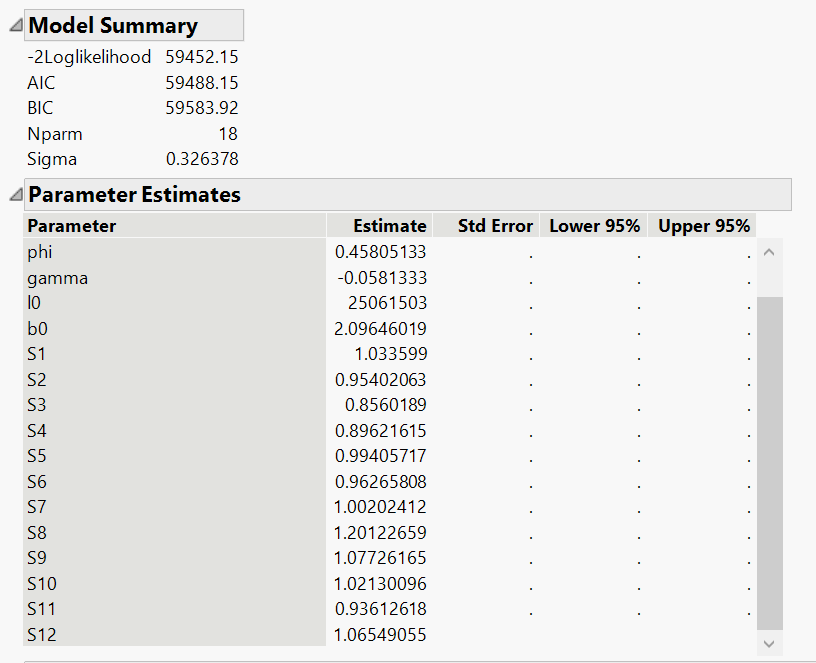

```{r setup, include=FALSE}
knitr::opts_chunk$set(echo = TRUE, eval=TRUE, message=FALSE,warning=FALSE) 
```

# Introduction

JMP software application is mainly used for statistical analysis. It is  a program created by SAS Institute Inc. The one main difference between SAS and JMP software would its interface where JMP has a graphical user interface that is compatible and is able to run on both Windows and Mac operating systems

There are several advantages of using JMP software, firstly it is able to streamlined its menu interface by having it being sort according to the context such as classic machine learning algorithm and time series analysis instead of statistical tests. 

Secondly, it is able to re-used output generated that was run earlier on. And even after running a procedure, it is able to add or remove additional statistics and graphs in the results window allowing for dynamic output. Lastly, it is able to merge with SAS as it is not only able to import/export SAS data, it is able to write and execute SAS code as well.

# Setting up environment

We would first start with setting up the environment and installation of the packages required for time series forecasting using R. To ensure that we had cleared the environment to perform data manipulation, we would remove prior R object using the code below

```{r}
rm(list=ls())
```

Next, we would run the following code chunk to validate if the required packages are installed. In the event that the packages are not installed, the code will install the missing packages. Afterwhich, the code would read the required package library onto the current environment.

```{r}
packages = c('dplyr','tidyquant','data.table','rmarkdown','knitr')

for (p in packages) {
  if(!require(p,character.only = T)){
    install.packages(p)
  }
  library(p,character.only = T)
}
```

# Dataset used for analysis

In this article, we will be using the dataset where we extracted the Microsoft stock price from Yahoo Finance. Similarly as before, dataset extraction is conducted using the *tidyquant* R packages where *tidyquant* provides a function *tq_get()* for directly loading data as mentioned in the previous article[insert link]. 

We will be querying daily data for Microsoft stocks from April 2015 to 31 March 2021 using the following the code chunk to perform data extraction. The data extracted would be the dataset that we will be using for our following analysis and review on the time series feature within the JMP pro software.

```{r}
from_date = "2015-04-01"
to_date = "2021-03-31"
period_type = "days"  # "days"/ "weeks"/ "months"/ "years"
stock_selected = "MSFT"

stock_data_daily = tq_get(stock_selected,
               get = "stock.prices",
               from = from_date,
               to = to_date)%>%
  mutate_if(is.numeric, round, digits = 2)

head(stock_data_daily)
```

# Single time series visulization

In this article, we will be reviewing the several available features in the JMP pro software application for time series analysis as well as time series forecasting. After we had load the data into the JMP pro platform we will then be able to create a time series line graph using graph builder or time series analysis function. Using the time series analysis function, the time series window appears with the following component shown in the diagram below.

The Time Series window comprises of three graphical visualization which are the Time Series graph, Autocorrelation (ACF) and Partial Autocorrelation (PACF). Using this user is able to perform a quick analysis to identify any hidden trend or seasonal pattern using the Time Series graph (top chart). 

ACF and PACF are also useful in the understanding of lag time together with lag plot (shown in diagram 2) to help understand what should the variable we should use for modeling using ARIMA later on. The down side of the ACF and PACF plot in the JMP pro software would be that it not very user friendly, where the graph is currently position vertically instead of horizontally that was being used by common statistician.


Figure 1: Single time series plot of the volume of Microsoft share price against time 

As mentioned earlier, having the lag plot and box-cox transformation in the following help user to check that the the times series is auto-regressive/sinusoidal model and ensure stationary respectively. The benefit of using JMP pro application for box-cox transformation is where it allow user to effectively change the lambada value to transform the current time series data into a stationary dataset.


Other than performing time series analysis, on this same window user is able to to perform time series forecasting using exponential smoothing and other classic time series model such as MA,ARIMA model.

Different modeling technique and features of the JMP pro application are as follow together with its useful feature on it:

## Exponential smoothing model

Exponential smoothing model could be easily conducted to forecast the time series of the volume of Microsoft shares. Having the quick glance model summary table, allow the different type model performance to be quickly calculated and display in table form. However, this features has its limitation as well especially for user that is not very knowledgeable of exponential smoothing model. There might be difficulty for user to benachmark which model metric is to be used in the evaluation of the model

Other than the model summary table, the JMP pro application is able to visualized the exponential smoothing model too, providing the user the predict volume of Microsoft share.

 

## ARIMA model

Not only is exponential smoothing model is possible, other time series model such as ARIMA modeling is possible as well in the following diagram. The JMP pro software provide the user a comprehensive analysis and result of the ARIMA model. 

 


## Model Performance

After trying and testing our various time series model, user would need to compare and analysis the accuracy metric to have a look at which model is much suitable for the particular dataset. Having the selection function, allow user to be able to select which model to compare easily.


# Time series forecasting

In the next section of the article, we will be looking at using the second component of the time series platform in JPM software, time series forecasting. Using this time series forecasting, the JPM pro software is able to auto generate a time series model for user just by a drop a dataset.

Within the JMP pro software, there is both the time series platform (shown in the previous section) as well as the time series forecasting analysis feature to allow the time series model to be auto generate using the application. This allow user to effectively perform time series forecasting (in the diagram below) without the need to decide which variable or time series model to select as the user will just need to identify which variable he/she would like to predict using time series forecasting and the application is able to perform the analysis as well as forecasting

Following are some of the analysis or result that is generated using the auto-time series model within the application. Firstly, it contain a main forecast graph where it allow user to compare to actual value as where as the forecast interval to allow user to be view the forecast result. Also, using the quick summary table (located at the top) user would be able to have a basis understand on the model type that is currently being used.


Figure 1: Forecast result of the volume of Microsoft share price against time 

Next, after we had obtain the forecast result, user would need to have a look at model performance from the following visualization, this where the model summary table comes in handle. With one glance, user will be able to retrieve the relevant model performance metric such AIC score. User could used this as an indicator to identify if the auto generated model is suitable for the particular dataset or not.

Additionally, the model performance consist of the section on parameter estimate where user would be able to use it to identify which variable have a stronger impact on the time series forecasting model as compared to the rest.


Figure 2: Model performance of the predicted volume of Microsoft share price against time

Another prescriptive of the JMP pro application would be where it allow user to calculate the one step ahead forecasting error of the forecast model shown in the diagram below. One-step ahead forecasts usually required user to compute model errors during the model estimation process but with this build in tool, user is able to compute this effectively.

It is usually computed sequentially for each data point by using computed level and trend states for the current point, and seasonal states for the last seasonal period. Having a smaller errors correspond to a better model fit,hence user is able to use the auto-generated model for their time series forecasting


Figure 3: One step ahead forecasting error

Currently, the auto-generated time series forecasting only allow the generation of exponential smoothing model. This is quite a limitation as compare to exponential smoothing model other classic time series model such as ARIMA and SARIMA is much more common used nowadays for time series forecasting due to it higher accuracy metric.

# Conclusion

Overall, the JMP pro software application is a useful tool to perform quick time series analysis that is mainly based on user input for its variable as well as the the selection of the model to be used. This required user to have basic understanding and knowledge of time series concept, that would allow the time series model to be perform accurately. 

This application is useful for user such as statistician to be able to analysis the result comprehensively where crucial figure such as ACF,PACF,lag plot, box cox transformation that could be graphically visualized.

Another advantage and issue with the JMP pro application would be that it is quite comprehensive in its result but at times it could be abit too much. This may caused user using it to be confused and not able to effectively evaluation the time series model. It would be better if there could be a selection of key model metric for user to select which model metric they would like to have instead.

As such, the JMP pro application is a useful tool with comprehensive user interface and graphical visualization that allow the user to have alot of ability and freedom to manipulate the  time series model based on their user. The limitation would be that user would need basic concept knowledge of time series else it might be time consuming and overwhelming for users.

# Reference

* Brownlee, J. (2019, August 28). How to use power transforms for time series forecast data with python. Machine Learning Mastery. https://machinelearningmastery.com/power-transform-time-series-forecast-data-python/. 
* Energy consumption forecast Using JMP Pro 11 time Series Analysis.pptx. JMP User Community. (2014, September 12). https://community.jmp.com/t5/Discovery-Summit-2014/Energy-Consumption-Forecast-Using-JMP-Pro-11-Time-Series/ta-p/21765. 
* Forecasting: Principles and Practice (2nd ed). 3.2 Transformations and adjustments. (n.d.). https://otexts.com/fpp2/transformations.html. 
* Key features of jmp pro. Key Features of JMP Pro | Statistical Discovery Software from SAS. (n.d.). https://www.jmp.com/en_sg/software/predictive-analytics-software/key-features-of-jmp-pro.html. 
* Napier, G. (2020, September 8). Time series. Chapter 6 Forecasting. https://bookdown.org/gary_a_napier/time_series_lecture_notes/ChapterSix.html. 
* Plummer, A. (2020, September 7). Box-cox transformation: Explained. Medium. https://towardsdatascience.com/box-cox-transformation-explained-51d745e34203. 
* Salvi, J. (2019, March 27). Significance of ACF AND PACF plots in time series analysis. Medium. https://towardsdatascience.com/significance-of-acf-and-pacf-plots-in-time-series-analysis-2fa11a5d10a8. 
* Sas. (2021, March 23). New version of JMP and JMP Pro delivers more efficient analytics. https://www.prnewswire.com/news-releases/new-version-of-jmp-and-jmp-pro-delivers-more-efficient-analytics-301253194.html. 
* Statistical &amp; qualitative data Analysis Software: ABOUT JMP. LibGuides. (n.d.). https://libguides.library.kent.edu/statconsulting/JMP. 
* Stephanie. (2018, June 7). Lag plot: Definition, examples. Statistics How To. https://www.statisticshowto.com/lag-plot/. 
* Time series analysis and forecasting. JMP User Community. (2020, August 13). https://community.jmp.com/t5/Mastering-JMP-Videos-and-Files/Time-Series-Analysis-and-Forecasting/ta-p/285785?nobounce. 

